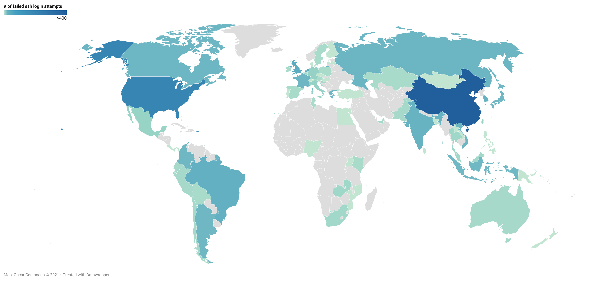

<!-- PROJECT SHIELDS -->
<!--
*** I'm using markdown "reference style" links for readability.
*** Reference links are enclosed in brackets [ ] instead of parentheses ( ).
*** See the bottom of this document for the declaration of the reference variables
*** for contributors-url, forks-url, etc. This is an optional, concise syntax you may use.
*** https://www.markdownguide.org/basic-syntax/#reference-style-links
-->
[![Contributors][contributors-shield]][contributors-url]
[![Forks][forks-shield]][forks-url]
[![Stargazers][stars-shield]][stars-url]
[![LinkedIn][linkedin-shield]][linkedin-url]

<!-- ABOUT THE PROJECT -->
## About The Project
While preparing for some upcoming interviews, I wanted to challenge myself to learn some new tools and hope to create/develop something for me to show off. I have a personal Linux Server running Ubuntu that I used all throughout college when working on assignments, projects, and personal projects. I knew very little about security when I first set the server up, but I was able to search around and find a way to secure it. I ended setting up a SSH Key Pair to make sure I was the only one allowed in. To strength that I disabled any other types of login other than logging in via my SSH Key.

I decided then to try analysing the my system logs of my server. I filter out failed ssh login attempts that matched `Failed password` attempts to get a list of those IP addresses. I also came across this tool called `hostintel` that would collect various intelligence sources for hosts which would allow me to see from where these attempts were coming from.

First, I looked around for what it was that I needed in order to make this work. I learned some neat Linux commands that allowed me to pull the necessary data from some folks over at [Black Hills Information Security](https://www.youtube.com/channel/UCJ2U9Dq9NckqHMbcUupgF0A). Their [Linux Command Line Dojo](https://youtube.com/playlist?list=PLTUOBi7lRRg_Ri3dBfWCAFP4cQXQnDt6G) series helped a tremendous amount when it came to being able to audit the necessary data for this to have come out the way it did.

Like I mentioned above, as I was looking for tools to play with I came across this called `hostintel` that uses a variety of different intelligence sources in order to pull a slew of information about a specific host. I had some issues getting it run initially but after troubleshooting some errors and submitting some issue tickets I was able to get it to output some useful information.

This is what I was able to come up with.

<!-- GETTING STARTED -->
## Getting Started
I needed to have administrative(root) level permissions in order to be able to view the system logs in `/var/log/auth.log`.

<!-- TOOLS -->
### Tools
* [hostintel](https://github.com/keithjjones/hostintel)
* [Datawrapper](https://app.datawrapper.de)

<!-- PREREQUISITES -->
### Prerequisites
* Python3
  ```sh
  sudo apt-get install python3
  ```
* Git
  ```sh
  sudo apt-get install git
  ```
### Steps:
#### Step 1: Switch User to root
  ```sh
  $ sudo su -
  ```
  
#### Step 2: Create folder for files
  ```sh
  # mkdir audit_practice
  # cd audit_practice
  ```
  
#### Step 3: Get `hostintel` tool 
##### (*This requires creating a config file so visit the [`hostintel`](https://github.com/keithjjones/hostintel) GitHub page for setup instructions*)
  ```sh
  # git clone https://github.com/keithjjones/hostintel.git
  ```

#### Step 4: Process `/var/log/auth.log` data with `awk` then sort IP address by all 4 numeric fields and store unique addresses. 
  ```sh  
  # awk '/Failed password/ {print $(NF-3)}' /var/log/auth.log >failed_ssh_attempts
  # sort -n -t: -k1,1 -k2,2 -k3,3 -k4,4 failed_ssh_attempts | uniq >sorted_failed_ssh_attempts
  ```
  
#### Step 5: Use `hostintel` to get more information about all the unique IP addresses.
  ```sh  
  # cd hostintel
  # python3 hostintel.py myconfigfile.conf ../sorted_failed_ssh_attempts -s -o >../sorted_failed_ssh_attempts.csv
  ```

### Results
Finally, after running `hostintel` I now have a CSV file with various information about each IP address I was able to pull. I was now able to see from where around the world my server was being attempted to be accessed. I went ahead in excel and found all the unique countries from which the attempts were coming from and got a count of the total number of unique attempts.

```
╔══════════════════════════════════╤═════╗	╔══════════════════════════════════╤═════╗
║ Arab Republic of Egypt           │ 1   ║	║ Malta                            │ 1   ║
╟──────────────────────────────────┼─────╢	╟──────────────────────────────────┼─────╢
║ Argentina                        │ 12  ║	║ Mexico                           │ 7   ║
╟──────────────────────────────────┼─────╢	╟──────────────────────────────────┼─────╢
║ Australia                        │ 3   ║	║ Monaco                           │ 1   ║
╟──────────────────────────────────┼─────╢	╟──────────────────────────────────┼─────╢
║ Austria                          │ 2   ║	║ Mongolia                         │ 1   ║
╟──────────────────────────────────┼─────╢	╟──────────────────────────────────┼─────╢
║ Bangladesh                       │ 1   ║	║ Mozambique                       │ 1   ║
╟──────────────────────────────────┼─────╢	╟──────────────────────────────────┼─────╢
║ Belgium                          │ 4   ║	║ Netherlands                      │ 54  ║
╟──────────────────────────────────┼─────╢	╟──────────────────────────────────┼─────╢
║ Bolivia                          │ 2   ║	║ New Zealand                      │ 1   ║
╟──────────────────────────────────┼─────╢	╟──────────────────────────────────┼─────╢
║ Brazil                           │ 37  ║	║ Nigeria                          │ 1   ║
╟──────────────────────────────────┼─────╢	╟──────────────────────────────────┼─────╢
║ Canada                           │ 18  ║	║ Pakistan                         │ 3   ║
╟──────────────────────────────────┼─────╢	╟──────────────────────────────────┼─────╢
║ Chile                            │ 3   ║	║ Panama                           │ 1   ║
╟──────────────────────────────────┼─────╢	╟──────────────────────────────────┼─────╢
║ China                            │ 479 ║	║ Papua New Guinea                 │ 1   ║
╟──────────────────────────────────┼─────╢	╟──────────────────────────────────┼─────╢
║ Colombia                         │ 13  ║	║ Peru                             │ 3   ║
╟──────────────────────────────────┼─────╢	╟──────────────────────────────────┼─────╢
║ Costa Rica                       │ 1   ║	║ Philippines                      │ 1   ║
╟──────────────────────────────────┼─────╢	╟──────────────────────────────────┼─────╢
║ Croatia                          │ 3   ║	║ Poland                           │ 2   ║
╟──────────────────────────────────┼─────╢	╟──────────────────────────────────┼─────╢
║ Cyprus                           │ 1   ║	║ Portugal                         │ 1   ║
╟──────────────────────────────────┼─────╢	╟──────────────────────────────────┼─────╢
║ Czech Republic                   │ 1   ║	║ Republic of Korea                │ 31  ║
╟──────────────────────────────────┼─────╢	╟──────────────────────────────────┼─────╢
║ Denmark                          │ 1   ║	║ Russian Federation               │ 20  ║
╟──────────────────────────────────┼─────╢	╟──────────────────────────────────┼─────╢
║ Ecuador                          │ 3   ║	║ Singapore                        │ 23  ║
╟──────────────────────────────────┼─────╢	╟──────────────────────────────────┼─────╢
║ Finland                          │ 1   ║	║ South Africa                     │ 4   ║
╟──────────────────────────────────┼─────╢	╟──────────────────────────────────┼─────╢
║ France                           │ 16  ║	║ Spain                            │ 2   ║
╟──────────────────────────────────┼─────╢	╟──────────────────────────────────┼─────╢
║ Germany                          │ 8   ║	║ Sri Lanka                        │ 1   ║
╟──────────────────────────────────┼─────╢	╟──────────────────────────────────┼─────╢
║ Greece                           │ 13  ║	║ Sweden                           │ 2   ║
╟──────────────────────────────────┼─────╢	╟──────────────────────────────────┼─────╢
║ Hong Kong                        │ 17  ║	║ Switzerland                      │ 1   ║
╟──────────────────────────────────┼─────╢	╟──────────────────────────────────┼─────╢
║ Hungary                          │ 1   ║	║ Taiwan                           │ 6   ║
╟──────────────────────────────────┼─────╢	╟──────────────────────────────────┼─────╢
║ India                            │ 28  ║	║ Thailand                         │ 5   ║
╟──────────────────────────────────┼─────╢	╟──────────────────────────────────┼─────╢
║ Indonesia                        │ 11  ║	║ Trinidad and Tobago              │ 1   ║
╟──────────────────────────────────┼─────╢	╟──────────────────────────────────┼─────╢
║ Ireland                          │ 2   ║	║ Tunisia                          │ 2   ║
╟──────────────────────────────────┼─────╢	╟──────────────────────────────────┼─────╢
║ Italy                            │ 8   ║	║ Turkey                           │ 1   ║
╟──────────────────────────────────┼─────╢	╟──────────────────────────────────┼─────╢
║ Japan                            │ 13  ║	║ Uganda                           │ 1   ║
╟──────────────────────────────────┼─────╢	╟──────────────────────────────────┼─────╢
║ Kazakhstan                       │ 2   ║	║ United Arab Emirates             │ 3   ║
╟──────────────────────────────────┼─────╢	╟──────────────────────────────────┼─────╢
║ Kenya                            │ 2   ║	║ United Kingdom                   │ 49  ║
╟──────────────────────────────────┼─────╢	╟──────────────────────────────────┼─────╢
║ Lao People's Democratic Republic │ 1   ║	║ United States of America         │ 243 ║
╟──────────────────────────────────┼─────╢	╟──────────────────────────────────┼─────╢
║ Latvia                           │ 1   ║	║ Vietnam                          │ 19  ║
╟──────────────────────────────────┼─────╢	╟──────────────────────────────────┼─────╢
║ Malaysia                         │ 4   ║	║ Zambia                           │ 5   ║
╚══════════════════════════════════╧═════╝	╚══════════════════════════════════╧═════╝
```

Finally I wanted to be able to display this data is a more visual way so I headed over to [Datawrapper](https://app.datawrapper.de), an open source used to create charts, and created a heatmap to show where the most unique IP address I found where coming from.



<!-- ACKNOWLEDGEMENTS -->
## Acknowledgements

* [Black Hills Information Security](https://www.youtube.com/channel/UCJ2U9Dq9NckqHMbcUupgF0A)
* [Keith J. Jones](https://github.com/keithjjones/hostintel)

[contributors-shield]: https://img.shields.io/github/contributors/ocastaneda3/multilayer-perceptron.svg?style=for-the-badge
[contributors-url]: https://github.com/ocastaneda3/multilayer-perceptron/graphs/contributors
[forks-shield]: https://img.shields.io/github/forks/ocastaneda3/multilayer-perceptron.svg?style=for-the-badge
[forks-url]: https://github.com/ocastaneda3/multilayer-perceptron/network/members
[stars-shield]: https://img.shields.io/github/stars/ocastaneda3/multilayer-perceptron.svg?style=for-the-badge
[stars-url]: https://github.com/ocastaneda3/multilayer-perceptron/stargazers
[linkedin-shield]: https://img.shields.io/badge/-LinkedIn-black.svg?style=for-the-badge&logo=linkedin&colorB=555
[linkedin-url]: https://linkedin.com/in/oscar-castaneda93/
